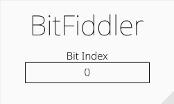

# BitFiddler

This is a very simple audio effect plugin, flipping one bit of each incoming sample. This results in a very harsh, digital distortion. Strictly speaking this is just a limited waveshaper.



This Plugin was built using the [nih_plug framework](https://github.com/robbert-vdh/nih-plug).

## Building

Precompiled binaries can be found in the [Releases tab](https://github.com/Leon-Focker/BitFiddler/releases/)

After installing [Rust](https://rustup.rs/), you can compile BitFiddler yourself as follows:

```shell
cargo xtask bundle bitfiddler --release
```
