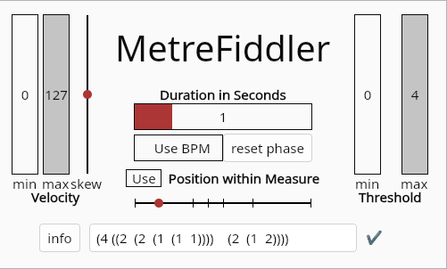

# MetreFiddler

MetreFiddler is a MIDI event processing plugin that applies an advanced adaptation of Clarence Barlow’s ideas of [metric indispensability](https://leon-focker.github.io/metrical-hierarchies/). It assigns new velocity values to rhythmic events and filters them based on their metric weight. Metric structures are defined using [RQQ](https://michael-edwards.org/sc/manual/rhythms.html#rqq) notation.



This Plugin is built using the [nih_plug framework](https://github.com/robbert-vdh/nih-plug) with a GUI powered by vizia.

## Use

MetreFiddler has MIDI input and output, which you need to route depending on your DAW. For example, in Reaper you can simply place the plugin on a channel that contains a MIDI item. In FL Studio, you can load the plugin anywhere but must set the MIDI input and output ports in the Plugin Wrapper settings. The MIDI events that pass through the plugin are then modified by MetreFiddler.

Based on the metric weight of an event within a measure, the event will either receive a new velocity value or be filtered out entirely. Which events are passed through or filtered is controlled by the threshold sliders, while the range for new velocity values is set by the velocity sliders.

The current position within a measure is determined either by the duration slider and playback time (the Reset Phase button can be automated to restart the measure) or by the position slider.

In the textbox, you can define a metric structure using RQQ notation. The onset of each beat defined this way is then shown on the position slider.

This is an example usage of MetreFiddler together with [VelocityMapper](https://github.com/Leon-Focker/VelocityMapper) that maps an incoming stream of Midi notes to drum samples according to a metric structure and warps the beat by automating some ofe the parameters:

https://github.com/user-attachments/assets/64b7fdbd-a32a-443a-833d-cf4d2dd834fc

## Building

Precompiled binaries can be found in the [Releases tab](https://github.com/Leon-Focker/MetreFiddler/releases/)

On macOS you may need to [disable Gatekeeper](https://disable-gatekeeper.github.io/) to be able to use this plugin.

After installing [Rust](https://rustup.rs/), you can compile MetreFiddler yourself with this command:

```shell
cargo xtask bundle metrefiddler --release
```
